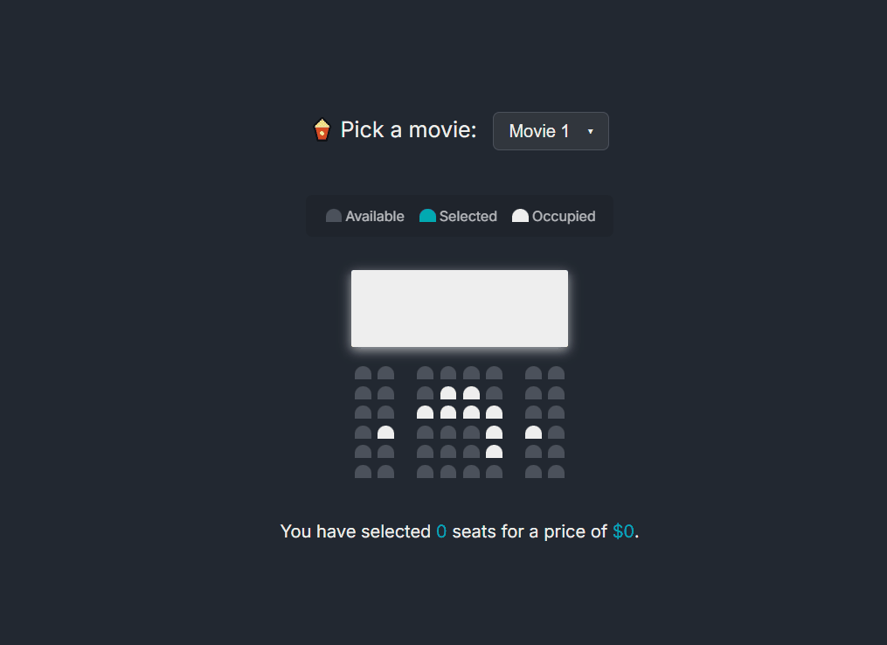

# Movie Seat Booking Front-end

A simple UI that simulates a movie seat booking experience, built with vanilla JavaScript.

I worked on this project to continue practicing core front-end concepts such as DOM manipulation and local storage. The selected seats and chosen movie persist even after refreshing or closing the page.

I went with a clean dark-mode design again for the interface, styled with basic CSS.

